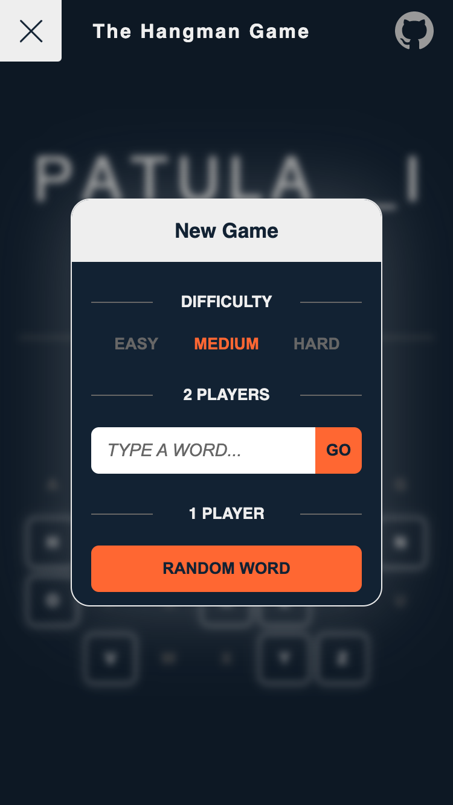
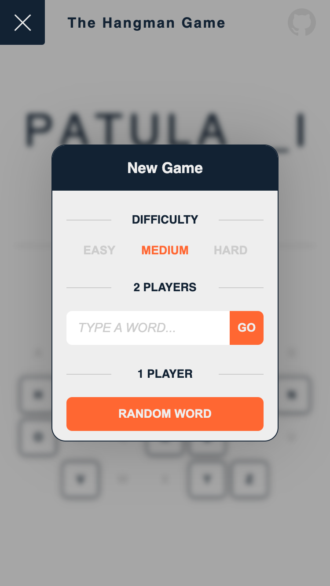
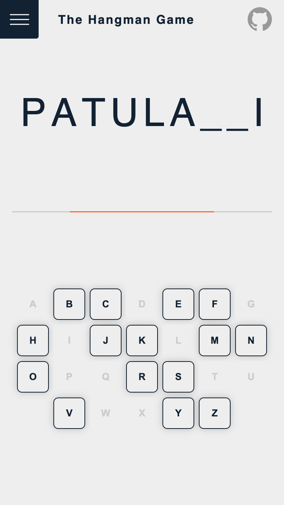

# functional-hangman

Functional implementation of the Hangman game with UI using Elm and CSS.

<a href="./docs/menu-dark.png"></a>
<a href="./docs/game-dark.png"></a>
<a href="./docs/menu-light.png"></a>
<a href="./docs/game-light.png"></a>

## Preview

➡️ https://functional-hangman.netlify.app

## Development

### Install and start

```
yarn && yarn dev
```

### Scripts

| Command           | Effect                                         |
| ----------------- | ---------------------------------------------- |
| `yarn`            | Installs dependencies                          |
| `yarn dev`        | Runs dev server on port 9999 (with HMR)        |
| `yarn build`      | Builds Elm source files to `build/main.js`     |
| `yarn clear`      | Clears build outputs                           |
| `yarn test`       | Runs Elm test suites                           |
| `yarn test:watch` | Runs Elm test suites in watch mode             |
| `yarn lint`       | Runs linters on Elm source files               |
| `yarn lint:watch` | Runs linters on Elm source files in watch mode |
| `yarn checkall`   | Runs linters and test suites                   |
